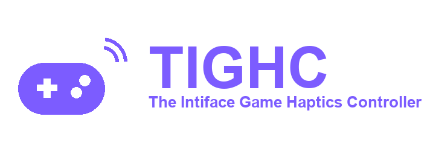

<p align="center">
  
</p>

# TIGHC Website

> **18+ only.** This is the website for TIGHC, software that connects to and
> controls adult haptic/sex toy devices. Intended for use only by adults aged
> 18 or older.

**Version 1.2.4** — see [CHANGELOG.md](CHANGELOG.md) for release history.

Source for [tighc.stuxie.dev](https://tighc.stuxie.dev), the landing site
for [TIGHC](https://github.com/TIGHC/Engine) (The Intiface Game Haptics
Controller). Plain HTML/CSS/JS, served directly from this repo via GitHub
Pages - no build step.

Website: https://tighc.stuxie.dev  
Repository: https://github.com/TIGHC/Website

## Author


**[StuxieDev](https://github.com/StuxieDev)**

<br>
<br>

## Structure

```
index.html        # landing page - what TIGHC is, features, how it works, get started
engine.html       # install/usage docs for the Engine (GUI, CLI, profiles, devices, settings)
profiles.html     # game profiles, fetched live from TIGHC-Profiles via the GitHub API
changelogs.html   # tabbed changelog viewer (Engine / Profiles / Website)
legal.html        # "Boring Legal Stuff" hub, linking to legal/*.html
legal/            # privacy, terms, cookies, imprint, disclaimer, opt-out pages
style.css         # shared styles across all pages
script.js         # 18+ notice (shown once per browser, via localStorage)
profiles.js       # fetches profiles.html's content from github.com/TIGHC/Profiles
changelogs.js     # fetches and renders CHANGELOG.md from each repo for changelogs.html
versions.js       # fetches VERSION.md from each repo on load and populates version badges site-wide
dev-config.js     # written by dev-server.py at startup - gitignored, never deployed
dev-server.py     # local dev server shared by dev-server.sh/.bat (see Local preview below)
dev-server.sh     # Unix wrapper for dev-server.py
dev-server.bat    # Windows wrapper for dev-server.py
tests/            # node:test unit tests for changelogs.js/profiles.js/versions.js
assets/           # logo/icon/author avatar, copied from the main TIGHC repo's assets/
CNAME             # custom domain (tighc.stuxie.dev) for GitHub Pages
```

`profiles.html` doesn't hardcode the game list - it calls the GitHub
Contents API to list folders in
[TIGHC-Profiles](https://github.com/TIGHC/Profiles), then fetches
each folder's `profile.json` from `raw.githubusercontent.com` to render its
bindings. Adding a profile there shows up here automatically, no edits
needed on this side.

## Local preview

See [DEV_GUIDE.md](DEV_GUIDE.md) to run the site locally.

## Deploying

GitHub Pages is configured to serve from this repo's root on `main` - just
push. The `CNAME` file points the custom domain at GitHub Pages; don't
remove it unless the domain setup is changing too. See
[INSTALL.md](INSTALL.md) for self-hosting elsewhere.

## Testing

The parsing/formatting logic in `changelogs.js`, `profiles.js`, and
`versions.js` (changelog Markdown parsing, profile binding/label
formatting and sorting, version-string handling) has unit tests under
`tests/`, using Node's built-in test runner - no extra dependencies
required:

```
node --test
```

CI (`.github/workflows/ci.yml`) runs these tests and validates the
top-level HTML pages with [html-validate](https://html-validate.org/) on
every push and pull request.

## Versioning and contact

Follows [Semantic Versioning](https://semver.org/) (`MAJOR.MINOR.PATCH`),
independently of the main TIGHC engine's own version - see
[CHANGELOG.md](CHANGELOG.md) for what changed in each release. Questions,
issues, or contributions: https://github.com/TIGHC/Website
